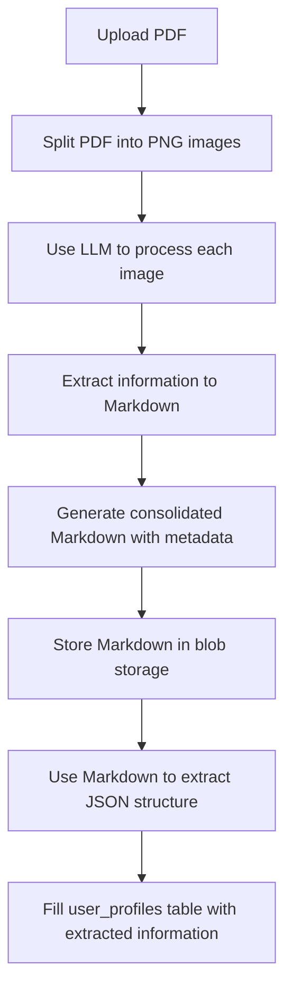

# PDF Processing Workflow

Workflow for processing PDF documents, extracting information using AI, and updating user profiles.

## Workflow Overview

This workflow processes a PDF through 6 sequential stages:



## Tasks Structure

### Individual Tasks

1. **`01-upload-pdf.ts`** - Uploads PDF to Vercel Blob storage
2. **`02-split-pdf-to-images.ts`** - Converts PDF pages to PNG images
3. **`03-process-images-with-llm.ts`** - Uses OpenAI GPT-4o to extract text from images
4. **`04-generate-consolidated-markdown.ts`** - Creates organized markdown with metadata
5. **`05-extract-json-structure.ts`** - Extracts structured profile data using LLM
6. **`06-update-user-profiles.ts`** - Updates user_profiles table in database

### Orchestrator

- **`orchestrator.ts`** - Chains all tasks together with error handling and progress tracking

## Usage

### Using the Full Workflow

```typescript
import { pdfProcessingOrchestratorTask } from "@/server/trigger/pdf-processing";

// Trigger the complete workflow
const result = await pdfProcessingOrchestratorTask.trigger({
  file: pdfFile, // File or Buffer
  fileName: "resume.pdf",
  userId: "user_123"
});
```

### Using Individual Tasks

```typescript
import { 
  uploadPdfTask,
  splitPdfToImagesTask,
  processImagesWithLlmTask 
} from "@/server/trigger/pdf-processing";

// Upload only
const uploadResult = await uploadPdfTask.trigger({
  file: pdfFile,
  fileName: "document.pdf", 
  userId: "user_123"
});
```

## Environment Variables Required

```env
OPENAI_API_KEY=your_openai_api_key
BLOB_READ_WRITE_TOKEN=your_vercel_blob_token
```

## Data Flow

### Input
- PDF file (File or Buffer)
- File name
- User ID

### Output
```typescript
{
  success: boolean;
  pdfUrl?: string;
  markdownUrl?: string;
  profileId?: string;
  totalPages?: number;
  fieldsExtracted?: string[];
  processingTime?: number;
  stages: {
    upload: { status: 'success' | 'failed'; message?: string };
    split: { status: 'success' | 'failed'; totalPages?: number };
    llmProcessing: { status: 'success' | 'failed'; pagesProcessed?: number };
    markdownGeneration: { status: 'success' | 'failed'; markdownUrl?: string };
    jsonExtraction: { status: 'success' | 'failed'; fieldsExtracted?: number };
    profileUpdate: { status: 'success' | 'failed'; profileId?: string };
  };
  error?: string;
}
```

## Blob Storage Organization

Files are organized in the following structure:

```
/pdfs/{userId}/{filename}         # Original PDF files
/images/{userId}/{filename}_page_N.png  # Extracted images
/markdown/{userId}/{filename}_consolidated.md  # Processed markdown
```

## Profile Data Structure

The workflow extracts and stores the following profile information:

- **Personal**: firstName, lastName, email, phone, address
- **Professional**: title, company, industry, experience, skills
- **Education**: institutions, degrees, graduation years
- **Additional**: certifications, languages, summary
- **Metadata**: processing confidence, source document, extraction timestamp

## Error Handling

Each task includes comprehensive error handling:
- Individual task failures don't stop the workflow
- Detailed error messages and logs
- Partial success tracking
- Graceful degradation for LLM failures

## Performance Considerations

- **Timeouts**: Individual tasks have appropriate timeouts (5-30 minutes)
- **Rate Limiting**: Built-in delays for API calls
- **Blob Storage**: Efficient file organization and access
- **Parallel Processing**: Tasks run sequentially but with optimal resource usage

